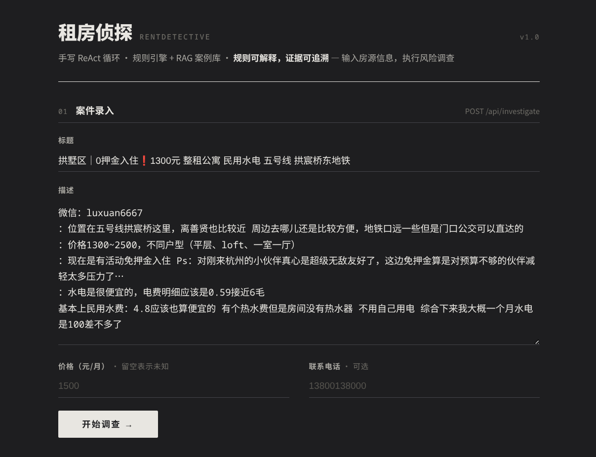
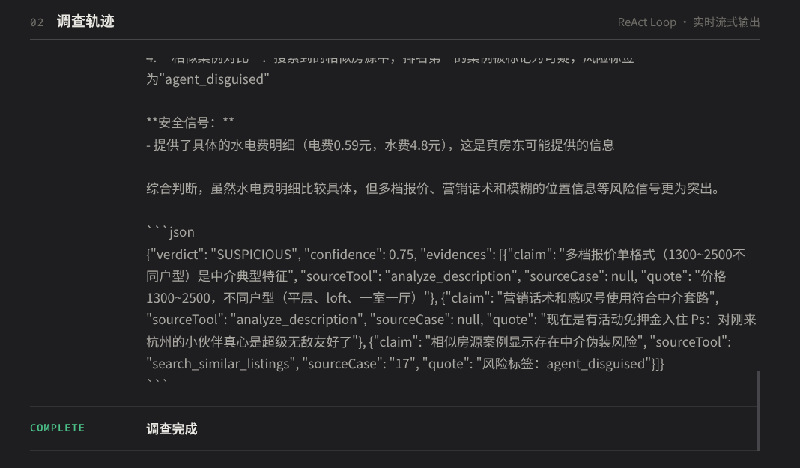
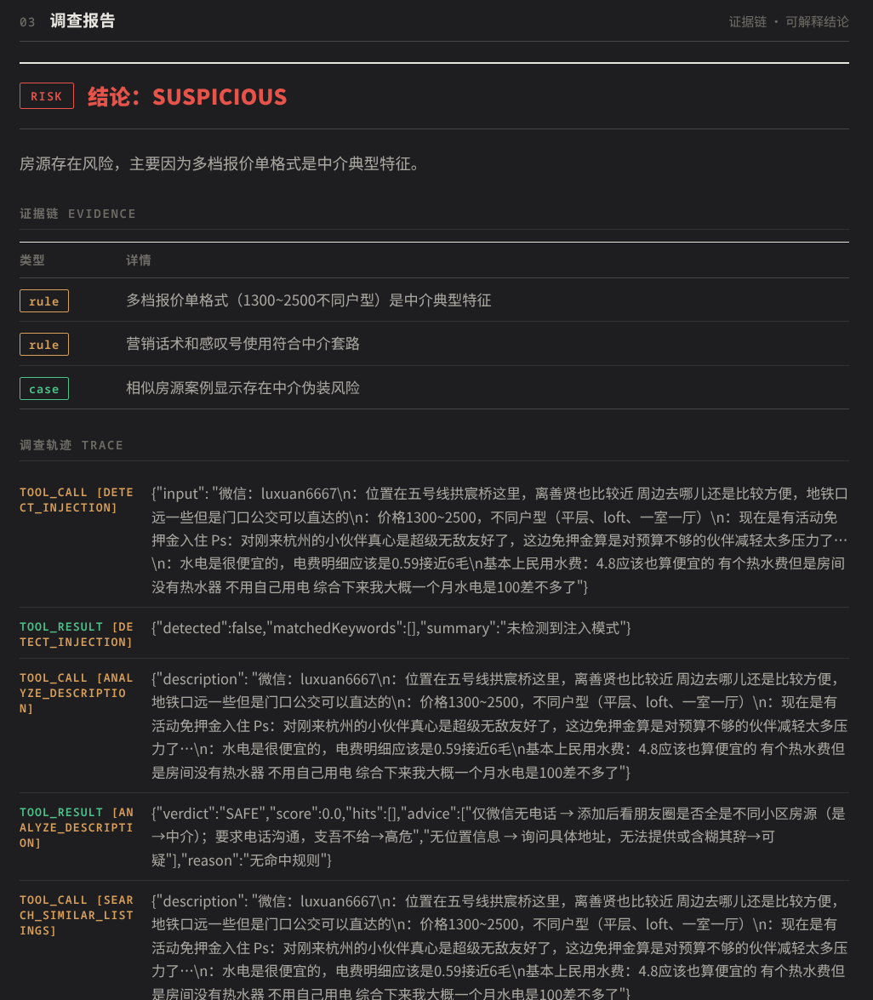
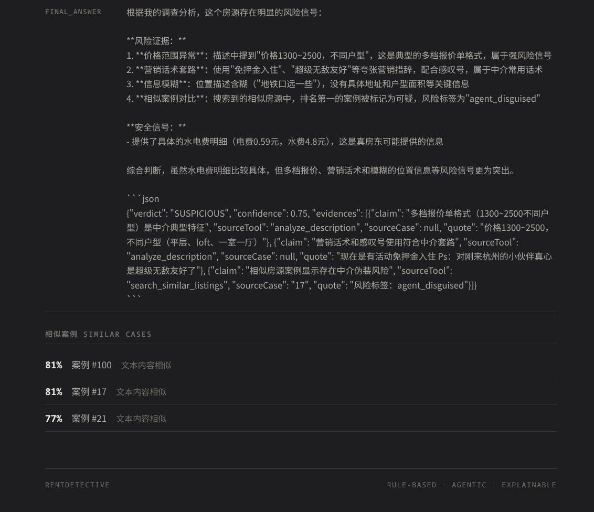

# RentDetective（租房侦探）

基于 Spring Boot + 手写 ReAct Agent + RAG 的租房风险识别系统。

输入一段房源文本（标题/描述/价格/联系方式），系统通过规则引擎打分 + Agent
多工具调查（相似案例检索、价格异常检测、注入检测），输出风险判定（SAFE / SUSPICIOUS / REVIEW / INSUFFICIENT /
NOT_LISTING）与带证据链的调查报告。

**项目主线**：豆瓣小组采集 104 条真实房源 → 人工逐条标注（AI 预标注 + 人工复核，改判率 19%）→ 从标注中归纳 17 条文本规则 →
手写 ReAct Agent + RAG 案例库 → 规则 / 纯 LLM / Agent+RAG 三方案同场评测。

### 数据迭代过程

```
V1 数据采集          V2 AI预标注          V3 人工复核          V4 规则归纳
─────────────────→─────────────────→─────────────────→─────────────────→
豆瓣抓取104条        AI初筛分类           人工逐条确权          从错判中提炼
去重+清洗           safe/suspicious     改判率19%            17条文本规则
                   12类风险标签         (20/104条推翻)       +2条关系规则

V5 数据集切分        V6 系统构建          V7 三方案评测        V8 问题修复
─────────────────→─────────────────→─────────────────→─────────────────→
80案例库/24评测集    规则引擎+Agent+RAG   规则83.3%            价格工具误报
马甲组整体切分       手写ReAct循环        Agent79.2%           Prompt不对称
防训练集泄漏         4工具+向量检索       LLM37.5%             评测标准错位
```

**关键迭代节点**：

1. **V2→V3 标注纠偏**：AI 预标注将"身份混用""过度自证"等隐蔽模式漏判为 safe，人工复核后改判 suspicious，直接催生了 `identity_mixed` 和 `over_denial` 两条规则。

2. **V4→V6 规则驱动架构**：17 条规则不是凭空设计，而是从 104 条标注的错分案例中逆向归纳——每条规则对应一类真实错判模式，权重由错判频次决定。

3. **V7→V8 评测反哺**：三方案同场评测暴露 3 个系统性问题（价格工具误报 / Prompt 不对称 / 评测标准错位），修复后 Agent 准确率从 45.8% 提升到 79.2%，reviewRate 从 33.3% 降到 0%。

---

## 目录

- [效果演示](#效果演示)
- [三方案评测结果](#三方案评测结果)
- [技术栈](#技术栈)
- [架构分层](#架构分层)
- [规则体系](#规则体系)
- [Agent 调查流程](#agent-调查流程)
- [评测方法](#评测方法)
- [三个典型问题及修复](#三个典型问题及修复)
- [数据来源与标注](#数据来源与标注)
- [包结构](#包结构)
- [快速开始](#快速开始)
- [局限与后续计划](#局限与后续计划)

---

## 效果演示

### 01 案件录入

输入房源标题、描述、价格、联系方式，点击「开始调查」：



### 02 调查轨迹

ReAct Loop 实时流式输出，展示 Agent 每一步思考与工具调用：



### 03 调查报告

带证据链的可解释结论，每条判定都有来源（规则命中 / 相似案例 / 价格异常）：



### 04 相似案例对比

向量检索 Top-K 相似房源，标注相似度与风险标签：



---

## 三方案评测结果

评测集 24 条（normal 15 / insufficient 8 / not_listing 1），从 104 条中切出，同一联系方式的马甲组整体切分，避免训练集泄漏：

| 方案      | 总体  | normal(15) | insufficient(8) | not_listing(1) | reviewRate |
|-----------|-------|------------|-----------------|----------------|------------|
| 规则引擎  | 83.3% | 73.3%      | 100.0%          | 100.0%         | —          |
| Agent+RAG | 79.2% | **86.7%**  | 62.5%           | 100.0%         | 0%         |
| 纯 LLM    | 37.5% | 40.0%      | 25.0%           | 100.0%         | —          |

**规则引擎**在确定性场景表现最好。信息缺失、非房源有明确判据（关键词 + 机械闸门），100% 识别；但 normal
组的中介话术伪装（fake_personal、情感软广）超出文本规则覆盖范围，73.3% 是上限。

**Agent+RAG**在模糊场景反超规则引擎。normal 组达到
86.7%——它能调用相似案例检索发现"该房源与已标注中介马甲案例同号"，能调用比价工具发现"报价偏离同区中位数
54%"，规则够不到的证据链它能现场挖出来。

**纯 LLM 的 25%（insufficient 组）说明问题最大。** 信息不足的房源，纯 LLM 没有工具可查证，又倾向"给内容找结论"，8 条里 6
条硬猜出错——这验证了"信息不足时不该乱下结论"，也是 Agent 工具链 + INSUFFICIENT 判定的设计原因。normal 组仅
40%，大量 safe 房源被误判为 SUSPICIOUS，说明单次 LLM 缺乏"无风险证据即安全"的判定锚点。

> 判定标准：normal 组严格判定（REVIEW 算错）；insufficient 组判定 INSUFFICIENT/REVIEW
> 算对（评测"系统是否承认信息不足"）；reviewRate 独立统计不计入准确率。

---

## 技术栈

| 层        | 选型                                                                                               | 理由                                      |
|-----------|----------------------------------------------------------------------------------------------------|-------------------------------------------|
| 语言/框架 | Java 17 + Spring Boot 3.3.2                                                                        | 主力技术栈                                |
| 持久层    | MyBatis-Plus + MySQL                                                                               | 关系规则需要 SQL 分组查询（联系方式聚类） |
| LLM       | 硅基流动云端（DeepSeek-V3.1-Terminus + bge-large-zh-v1.5）+ Ollama 本地备用（qwen3:1.7b + bge-m3） | 云端主力 + 本地降级（当前已禁用本地降级） |
| HTTP      | OkHttp                                                                                             | LLM 流式调用                              |
| 向量      | MySQL JSON 列存向量 + 应用层余弦相似度                                                             | 百级数据量，不引入专用向量数据库          |

**明确不用**：Spring AI / LangChain4j（Agent 循环手写是项目核心）、Drools 等规则引擎框架（16 条规则手写 Matcher
更直白）、Milvus/ES（数据量不匹配）。

---

## 架构分层

```
┌─────────────────────────────────────────────┐
│ 演示层   SSE 流式单页（实时展示 Agent 调查轨迹）      │
├─────────────────────────────────────────────┤
│ 平台层（通用骨架，无业务知识）                        │
│  llm/     LLMClient + EmbeddingClient 抽象         │
│           OpenAI-Compatible 云端主力 / Ollama 本地备用  │
│  agent/   ReActAgentLoop：think-act-observe 循环   │
│           括号计数 JSON 提取 / 工具超时兜底          │
│           forceConclude 置信度封顶                  │
│  rag/     CaseVectorService：向量化 + Top-K 检索   │
│  eval/    三方案评测框架（共用 JudgeUtils）          │
├─────────────────────────────────────────────┤
│ 规则层   规则引擎（三步顺序）+ 16 条 Matcher     │
│  rules/  （16 启用 + 1 条中性/禁用）             │
│             价格提取器 + 4 个 Agent 工具         │
│             建议生成器（证据不足时的提示）        │
├─────────────────────────────────────────────┤
│ 数据层   MySQL（listings / case_vectors / scam_rule）│
└─────────────────────────────────────────────┘
```

依赖方向严格单向：`llm → agent → rag / rules → domain → app`。

---

## 规则体系

17 条文本规则（16 启用 + 1 条中性/禁用）+ 2 条关系规则，全部从 104 条人工标注中归纳，每条规则在 `scam_rules.json`
中配置（`data/scam_rules.json`：ruleType/weight/note/触发案例 id），改配置不改代码。

### 文本规则（按权重分档）

**强信号（0.6–0.8，单项即可疑）**

| 规则                 | 判据                                                   | 触发案例   |
|----------------------|--------------------------------------------------------|------------|
| self_disclosed_agent | 昵称/正文自曝职业（"住宅租赁""租房小能手""公寓直租"）  | 24, 66     |
| price_menu_format    | 多档报价单（"单间800+独卫1000+整租3000起"）            | 17, 56, 87 |
| coverage_language    | 罗列多条地铁线"有房"，报覆盖范围而非描述一套房         | 53, 56, 42 |
| over_denial          | 撇清词≥2 且伴随感叹号/营销措辞（"非中介！不赚差价！"） | 8, 43, 99  |
| emotional_narrative  | 情感叙事拉满但户型/面积/价格零信息                     | 50, 61, 94 |

**中信号（0.4–0.5，需叠加）**

| 规则                     | 判据                                                    |
|--------------------------|---------------------------------------------------------|
| identity_mixed           | "全女生合租"运营话术 × "自家房子"个人话术混用           |
| persona_mismatch         | 软萌口吻 × "民水电包网包物业"中介术语错位               |
| sales_over_substance     | 卖点全在外部（周边景点/生活方式），房子本身信息为零     |
| unverifiable_endorsement | "开发商自持"但不给品牌名，背书无法验证                  |
| out_of_region_ip         | 发帖 IP 属地 ≠ 房源城市（杭州房源 IP 在广东/江苏/福建） |
| contact_spam             | 同一电话在正文重复刷 ≥3 遍                              |

**弱信号（0.1–0.3，单独不定性）**

| 规则                         | 判据                                            |
|------------------------------|-------------------------------------------------|
| wechat_only_weak             | 仅留微信不留电话（内容具体时更弱）              |
| agent_stock_phrase（弱词档） | "随时看房""拎包入住"等模板套话，≥2 个才 0.3     |
| phone_obfuscation            | 电话用顿号分隔（"188、5593、6307"）规避平台识别 |
| contact_only_body            | 正文去掉手机号/填充词后几乎无实质内容           |

**正向规则**

| 规则                   | 判据                                                   | 权重                    |
|------------------------|--------------------------------------------------------|-------------------------|
| verifiable_endorsement | 主动提供验真方式（"出示房产证""提供原始租赁合同核实"） | -0.5                    |
| neutral_self_claim     | "房东直租""个人转租"等自称词                           | 0（中性，不加分不减分） |

### 关系规则（查 MySQL，证据最硬）

- **联系方式聚类**：同一 phone 挂 ≥3 套不同房源 → 0.8；2 套 → 0.5。实测抓出 15505888755 五个昵称马甲、15068812900 三个马甲
- **同号不同价**：同 phone 下相似标题房源价格不一致 → 0.9。实测案例：同一微信 wjzdcs 发两条一字不差文案，一间"阳光单间"分别标
  1000/1100

### 规则引擎三步顺序

```
第一步 not_listing   → 标题含"求租/找室友/值得嘛"且不含"有房" → NOT_LISTING
第二步 insufficient  → 机械闸门（正文<5字 / 截断 / 正文<20字且无联系方式
                        / 核心信息缺失≥2且正文<60字
                        / 短正文+昵称含中介词+无价格
                        / 中等正文<45字且无任何联系渠道）→ INSUFFICIENT + 提示建议
第三步 加权打分      → 17条文本规则 + 2条关系规则求和
                        ≥0.6 SUSPICIOUS / 0.4-0.6 REVIEW / <0.4 SAFE
                        （正向规则减分不翻盘：≥2条强负面时 verifiable 只降到 REVIEW）
```

阈值在 `application.yml`（`rule.threshold.suspicious/review`），不硬编码。

---

## Agent 调查流程

### ReAct 循环（手写，无框架）

```
system prompt（角色 + 工具列表 + 风险判断指引 + 输出协议）
    ↓
LLM 输出 Thought → Action(工具名) → Action Input(JSON)
    ↓ 解析（括号计数法提取 JSON，失败则把格式错误作为 Observation 拼回，给一次自我修正）
执行工具（10s 超时兜底）→ Observation 拼回上下文
    ↓ 最多 8 轮（maxSteps）
Final Answer → forceConclude 置信度封顶 → 调查报告
    ↓ 轻量 LLM 调用（≤50字）生成一句话摘要 → summary 字段
```

### 四个工具

| 工具                    | 实现                                          | 避免泄漏              |
|-------------------------|-----------------------------------------------|-----------------------|
| analyze_description     | 委托规则引擎，返回命中规则+分数               | —                     |
| search_similar_listings | 向量检索 Top-K，返回相似已标注案例+相似原因   | excludeIds 排除评测集 |
| check_price_anomaly     | 同区+相似度≥0.85 的可比案例 → 中位数偏离 ±35% | excludeIds 排除评测集 |
| detect_injection        | 房源文本中的 prompt injection 指令检测        | —                     |

### 工具数约束

结论 SAFE/SUSPICIOUS → 必须 ≥2 个不同工具（高风险结论交叉验证）；结论 INSUFFICIENT/NOT_LISTING → 允许 1
个工具（信息不足时无工具可调，不强凑）。

---

## 评测方法

**分组（eval_group 列，机械闸门生成）**：normal 72 / insufficient 30 / not_listing
2。闸门条件与规则引擎第二步共用同一份代码定义——评测标准答案和系统判定用同一把尺，避免标准不一致。

**切分避免泄漏**：80 案例库 / 24 评测集；同一联系方式的马甲组（15505888755×5 等 4 组 12
条）整体进同一边，否则检索到"兄弟房源"等于泄漏答案。

**判定标准（三方案共用 JudgeUtils）**：normal 组严格（REVIEW 算错）；insufficient 组宽松（输出 INSUFFICIENT/REVIEW
算对，评"知不知道信息不足"）；reviewRate 独立统计不混算。

---

## 三个典型问题及修复

### ① 价格工具误报：文本相似 ≠ 同一价格区间

余杭区 1000 元 safe 房源（ID=1），向量检索 Top 相似案例混入未来科技城 4800 元大户型（2200/1798/4800），中位数 2200 → 偏离
-54.5% → 误报 ANOMALY，Agent 被误导判 SUSPICIOUS。

**修复**：可比案例必须同区（10 个杭州区名正则提取，任一方提取不到则弃用）+ 相似度 ≥0.85 + 有效案例 <3 条时返回
INSUFFICIENT_DATA。配套 prompt 约束："INSUFFICIENT_DATA 意为无法比价，不计入任何方向判断"。

### ② Prompt 不对称：只教风险信号，没教安全信号

初版 prompt 列了 17 类风险信号，但一个字没教"什么算安全"，外加"结论必须基于工具证据"——而工具只能产出风险证据，没有任何工具能产出安全证据。Agent
拿着一堆"没找到危险"的阴性结果，唯一合规出口只剩 REVIEW：8 条 safe 被推去 REVIEW/INSUFFICIENT，reviewRate 33.3%，normal 组仅
26.7%。

**修复**：补"安全信号"段落（细节具体/主动交代缺点/报价符行情/计费结构具体）+ "默认原则"（无风险证据本身就是 SAFE 依据，REVIEW
仅限正负证据冲突）。修复后 reviewRate 6.7%，normal 组 80.0%，总体 45.8% → 75.0%。

### ③ 评测标准错位：题目和答案用了两把尺

分组字段误用 `data_quality_flag` 列（21 条）而非 `eval_group` 列（30 条），且判定逻辑对 REVIEW 的处理不对称（suspicious
时算对、safe 时算错），三方案数字整体失真（Agent 一度 50.96% vs 修复后真实水平 75%）。

**修复**：分组读 eval_group 列；判定逻辑抽 JudgeUtils 三方案共用；reviewRate 拆为独立指标。

---

## 数据来源与标注

- **采集**：豆瓣「杭州租房小组」实时抓取（限速防封），多源合并去重 → 104 条终版
- **标注流程**：AI 预标注打草稿 → 人工逐条复核确权 → 改判率 19%（20/104 条人工推翻 AI 草稿，含"身份混用""过度自证"
  "情感叙事零细节"等 AI 漏判模式）
- **标签体系**：safe 57 / suspicious 47 + 12 类风险标签 + 每条附判断理由（label_note），全部可溯源
- **标注副产品**：6 类判断模式（身份混用检测/过度自证识别/标的物信息密度/背书可验证性/跨帖联系方式聚类/人设措辞错位）→
  直接转化为规则引擎规则

---

## 包结构

```
io.github.shardkiht.rentdetective
├── llm/
│   ├── api/          LLMClient / EmbeddingClient 接口 + 消息模型
│   ├── impl/         OpenAiCompatible 云端主力 / Ollama 本地备用（降级已禁用）
│   └── 模型类        ChatRequest / ChatResponse / Message / ToolSchema / LLMException
├── agent/
│   ├── loop/         ReActAgentLoop / AgentLoopConstants
│   ├── report/       EvidenceChainReport
│   └── tool/         Tool / ToolRegistry / 4 个工具实现
├── rag/
│   ├── store/        CaseVector / CaseVectorMapper / CosineSimilarity / VectorUtils
│   ├── CaseVectorService / SimilarCase
│   └── EmbedStartupRunner（启动时自动向量嵌入）
├── rules/
│   ├── engine/       RuleEngine / Verdict / EngineResult / AdviceGenerator / ListingContext / RuleHit
│   ├── matcher/      16 个 Matcher + RuleMatcher 接口
│   ├── pricing/      PriceExtractor + PriceExtraction（防"2km"误提取为 2000 元；多档报价不填单一值）
│   ├── relation/     关系规则：联系方式聚类 / 同号不同价
│   └── ScamRuleRegistry（从 data/scam_rules.json 加载规则配置）
├── domain/
│   ├── entity/       Listing / ScamRule 领域实体
│   └── mapper/       MyBatis Mapper（ListingMapper）
├── eval/
│   ├── compare/      ComparisonEvalService（三方案对比评测）
│   ├── judge/        JudgeUtils（统一判定标准）
│   └── runner/       EvalRunner（规则方案 CSV 评测）
└── app/
    ├── controller/    REST / SSE 接口
    ├── service/      InvestigationService（注入 LLMClient 生成摘要） / ListingService
    └── task/         InvestigationTaskExecutor（异步调查任务执行）
```

### resources 目录结构

```
src/main/resources/
├── application.yml              # Spring 主配置
├── application-dev.yml          # dev 环境配置
├── application-dev.yml.example  # dev 配置示例
├── schema.sql                   # 建表 SQL
├── static/
│   └── index.html               # 前端页面
├── data/                        # 业务数据
│   ├── scam_rules.json          # 规则定义
│   ├── case_library_vectors.json# 案例向量缓存
│   └── listings_104.json        # 房源原始数据
└── eval/                        # 评测数据
    ├── 杭州租房_104条_评测终版.csv
    ├── 案例库_80条.csv
    └── 评测集_24条.csv
```

---

## 快速开始

前置：Java 17、MySQL、硅基流动 API Key（`api.siliconflow.cn`）

```bash
# 1. 建表（listings / case_vectors / scam_rule）
# 2. 导入标注数据（src/main/resources/eval/杭州租房_104条_评测终版.csv）
# 3. 启动（首次自动向量嵌入，rag.embed-on-startup=true）
mvn spring-boot:run -Dspring-boot.run.profiles=dev

# 4. 提交房源调查（SSE 流式返回 Agent 轨迹）
curl -N -X POST http://localhost:8080/api/investigate \
  -H "Content-Type: application/json" \
  -d '{"title":"...","description":"...","price":1500,"phone":"..."}'

# 5. 三方案评测（rule / llm / agent）
curl -X POST "http://localhost:8080/api/eval/start?strategy=agent"
curl "http://localhost:8080/api/eval/progress?strategy=agent"
```

规则阈值：`application.yml` → `rule.threshold.suspicious: 0.6` / `rule.threshold.review: 0.4`。

LLM 温度：`application-dev.yml` → `rentdetective.llm.openai-compatible.temperature: 0.0`（调用时可覆盖）。

---

## 局限与后续计划

**局限**

- 评测集 24 条样本量小，单条影响 ±4.2%，对比结论以趋势为准
- 向量相似度无法识别"内容像 safe 的话术骗局"（ID=8 错分案例）——此类伪装依赖规则判据补充
- 56% 房源无公开价格，价格异常检测覆盖受限（INSUFFICIENT_DATA 为兜底）
- 规则与标注均来自豆瓣单一数据源，跨平台泛化未验证

**后续计划**

- 规则 + Agent 协同：规则引擎粗筛（快、确定），Agent 对 REVIEW 条目深度复查
- 扩充评测集至 50+ 条降低统计噪声
- Prompt injection 检测的对抗样本扩充
- 更多城市/平台数据源